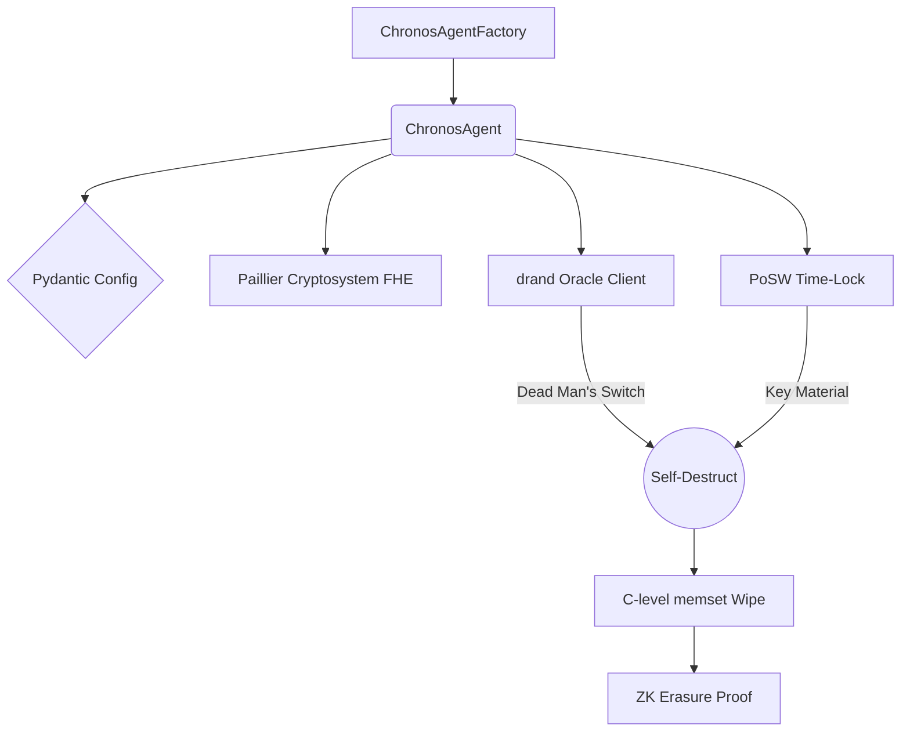

# \u23f1\ufe0f Project CHRONOS
**Enterprise-Grade Autonomous Agent with Provable Cryptographic Self-Termination**

[](.github/workflows/qa.yml)
[](https://github.com/psf/black)
[](http://mypy-lang.org/)
[](https://github.com/PyCQA/bandit)
[](tests/)

Project CHRONOS is a cutting-edge autonomous agent framework built on tier-one software engineering principles. It solves the critical safety problem of runaway AI by guaranteeing **mathematical, irreversible self-destruction** at a predefined deadline.

## \ud83d\udee1\ufe0f The Three Pillars of Security
1. **Plaintext Blindness**: Computations use a True Paillier Fully Homomorphic Encryption (FHE) engine (`fhe_engine.py`). The agent processes data blindly without ever seeing plaintext.
2. **Deterministic Time-Bound Existence**: The decryption key is locked behind a strict Proof of Sequential Work (`posw.py`) hash chain. Even with infinite parallel computing power, the key cannot be unlocked early.
3. **Zero-Knowledge Erasure**: A Fiat-Shamir NIZK proof certifies that the private key material was physically wiped from C-level RAM (`memory_sanitizer.py`) upon mission completion.

## \u2699\ufe0f Architecture
The codebase employs an elite, strictly-typed Object-Oriented design utilizing Dependency Injection, Pydantic validation, and Structural Subtyping.



## \ud83d\ude80 Quickstart

### 1. Installation
Ensure Python 3.11+ is installed. Clone the repository and install dependencies:
```bash
pip install -r requirements.txt
pip install pre-commit pytest pytest-cov pydantic pydantic-settings cryptography
```

### 2. Initialize Enterprise QA (Mandatory)
This repository is guarded by strict `pre-commit` Git hooks. You must install them before contributing:
```bash
git init
pre-commit install
```
*(This ensures all commits are automatically audited by Black, Flake8, Isort, Mypy, and Bandit).*

### 3. Execution
Launch the orchestrator:
```bash
python chronos_agent.py --duration 10
```
*(The agent will boot, perform an FHE inference, poll the drand network for the deadline, verify the PoSW, and ultimately trigger a physical RAM shred and NIZK Erasure Proof).*

## \ud83e\uddea Testing
Run the comprehensive, mocked unit test suite with strict coverage enforcement:
```bash
pytest --cov=. --cov-fail-under=90 tests/
```
